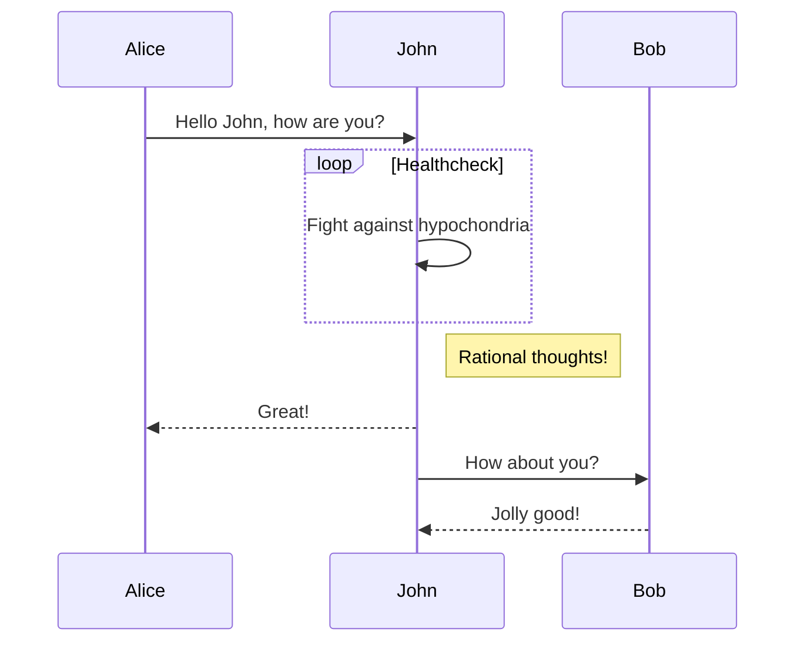

# Introdução ao MKDOCS

Vídeos Referências:

!!! tip "Como inserir um vídeo em Markdwon"

    https://stackoverflow.com/questions/14192709/is-it-possible-to-embed-youtube-vimeo-videos-in-markdown-using-a-c-sharp-markdow

    Neste link tem tudo explicado como inserir um vídeo em Markdown.

!!! info "Plugins Mkdocs"

    Lista de Plugins disponíveis:
    https://github.com/mkdocs/mkdocs/wiki/MkDocs-Plugins

    Outras leituras:
    https://chrieke.medium.com/the-best-mkdocs-plugins-and-customizations-fc820eb19759

    Neste link tem tudo explicado como inserir um plugin.

!!! question "Plugins Git Authors"

    Modo de instalação vide:   https://github.com/mkdocs/mkdocs/wiki/MkDocs-Plugins

    {{ git_page_authors }}

Exemplo origem:
https://squidfunk.github.io/mkdocs-material/reference/data-tables/


| Method      | Description                          |
| ----------- | ------------------------------------ |
| `GET`       | :material-check:     Fetch resource  |
| `PUT`       | :material-check-all: Update resource |
| `DELETE`    | :material-close:     Delete resource |


## Exemplos

[](https://vimeo.com/3514904 "Little red riding hood - Click to Watch!")

[](https://www.youtube.com/watch?v=k7rkjVfuB2M "Mkdocs com Gitlab")


## Ativando Keys Extension

```yml title="mkdocs.yml" hl_lines="5"
markdown_extensions:
  - meta
  - admonition
  - footnotes
  - pymdownx.keys
  - pymdownx.highlight: # https://squidfunk.github.io/mkdocs-material/setup/extensions/python-markdown-extensions/#inlinehilite
      auto_title: true
      anchor_linenums: true
      linenums: true
      linenums_style: pymdownx-inline
  - pymdownx.inlinehilite
  - pymdownx.superfences

```


[Keys Ref](https://facelessuser.github.io/pymdown-extensions/extensions/keys/)

!!! note
    ++ctrl+alt+delete++


## Ícones e Emojis

[Emojis](https://squidfunk.github.io/mkdocs-material/reference/icons-emojis/#configuration)


## Configurando os Ícones das Notas

[Admonitions](https://squidfunk.github.io/mkdocs-material/reference/admonitions/#admonition-icons)


```markdown title="mkdocs.yml" hl_lines="3-16"
theme:
  name: material
  icon:
    admonition:
      note: octicons/tag-16
      abstract: octicons/checklist-16
      info: octicons/info-16
      tip: octicons/squirrel-16
      success: octicons/check-16
      question: octicons/question-16
      warning: octicons/alert-16
      failure: octicons/x-circle-16
      danger: octicons/zap-16
      bug: octicons/bug-16
      example: octicons/beaker-16
      quote: octicons/quote-16
```





!!! note "Lembrete"
    $$
        E(\mathbf{v}, \mathbf{h}) = -\sum_{i,j}w_{ij}v_i h_j - \sum_i b_i v_i - \sum_j c_j h_j
    $$


!!! tip "Comandos para Visualização da Documentação"

    * `mkdocs serve -a localhost:8001 --livereload` - Inicia um servidor para mostrar a documentação e atualiza automaticamente.
    * `mkdocs build` - Constrói o HTML estático no diretório site.

!!! info "Criando a documentação"
    `mkdocs new [dir-name]` - Criar uma nova documentação ex: `mkdocs new .` e será criado um `index.md dentro de docs` e um arquivo `mkdocs.yml`

## Exemplo de Código

```python title="main.py" hl_lines="1 2"

def main():
    print("Hello")
    print("Teste")

```
